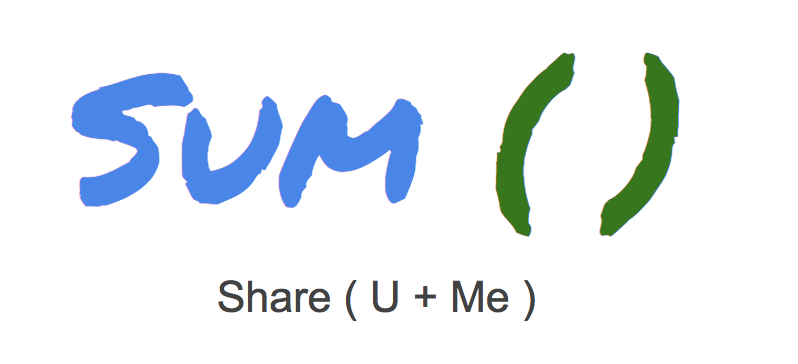

## SUM ( U + Me )
### Share Sum Stuff
---



---

```
Sum is an online app that makes sharing tangible items easy. 
  1.) What do you want to share
  2.) Upload information about your item
  3.) Add friends and/or family to a group
  4.) Send an email to the group
  5.) Find someone who wants your item

```
---
### Client GitHub Repo

[https://github.com/darrenhankins/sum-client](https://github.com/darrenhankins/sum-client)

```
Technologies
  - Angular
  - JavaScript
  - HTML5
  - CSS
  - Bootstrap
  - Firebase
```

### Server GitHub Repo
[https://github.com/darrenhankins/sum-server](https://github.com/darrenhankins/sum-server)

```
Technologies
  - Nodejs
  - Express
  - Knex
  - PostgreSQL
  - Heroku
  - Objection.js


```
